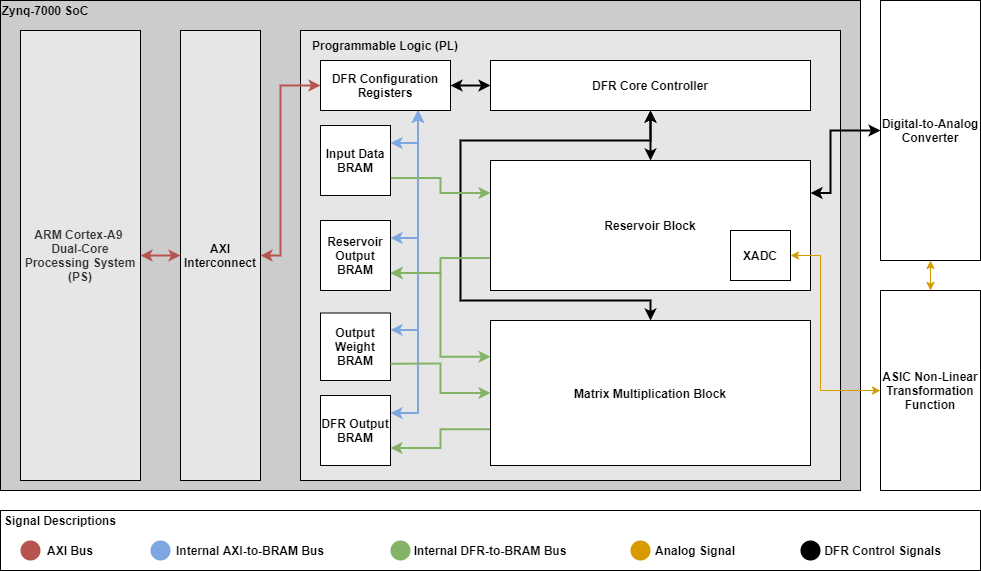

# Hybrid DFR System
This repository contains the FPGA design for MICS' Hybrid DFR System. 
The logic here is implemented on a Zynq-7000 XC7Z020 System-on-Chip (SoC).
PetaLinux is used to boot the Zynq's embedded ARM processor and interface with the DFR hardware.

## Dependencies
- Vivado
- Vitis
- PetaLinux
- Python3
    - NumPy
    - Scikit-learn
    - Matplotlib

## System Architecture


## System Specifications
| Spec | Estimate
| --------------- | ------------- |
| PL Clock Frequency |   10 MHz          |
| Dynamic Power      |   130 mW     |


## Logic Utilization


| Logic Type | Elements Used | Utilization Percentage
| --------------- | --------------- | --------------- |
| Slices          |   1319          | 9.92%
| Slice LUTs      |   2328          | 4.37%
| Slice Registers |   1934          | 1.82%
| DSPs            |   3             | 1.36%
| Block RAM Tiles |   118           | 84.29%


## Directory Organization
```
.
├── linux                   # contains the petalinux configuration information and code to use the embedded hardware interfaces
│   │
│   ├── code_examples       # contains code to use the embedded hardware interfaces
│   │
│   │   ├── asic_function   # contains code to use the ASIC function hardware
│   │   │
│   │   ├── dfr_fpga        # contains code to use the DFR accelerator hardware
│   
├── python                  # contains the Python software models used to simulate the system behavior
│   │
│   ├── data                # contains the data used to train and test the software and hardware models
│   
├── rtl                     # contains the SystemVerilog code used to build the DFR accelerator hardware
│   │
│   ├── src                 # contains the synthesizable source code used to build the DFR accelerator
│   │
│   ├── tb                  # contains the simulation source code used to verify the DFR accelerator functionality
│   
├── vitis                   # contains debugging code used to test the hardware in Vitis after implementation
│ 
├── vivado                  # contains the Vivado project scripts to develop the DFR accelerator IP cores and bitstream file
│ 
├── xdc                     # contains the constraints for the Vivado projects
```

## Generating the Bitstream and XSA Files
There different Vivado projects can be created with the `.tcl` scripts in the `vivado` directory:

### ASIC Activation Function Project
To create the hardware project for evaluating only the ASIC activation function, the following scripts should be run:
```
vivado -mode tcl -source runAsicFunctionProject.tcl # generates an IP core for interfacing with the ASIC
vivado -mode tcl -source runAsicFunctionSystemProject.tcl # generates a .bit and .xsa file for impelemnting the ASIC function hardware
```

### DFR FPGA Standalone Project
To create the hardware project for evaluating the DFR with an embedded ROM that mimics the behavior of the ASIC, the following scripts should be run:
```
vivado -mode tcl -source runDFRCoreProject.tcl # generates an IP core for the standalone FPGA DFR accelerator
vivado -mode tcl -source runDFRCoreSystemProject.tcl # generates a .bit and .xsa file for impelemnting the standalone FPGA DFR accelerator hardware
```

### DFR FPGA Hybrid Project
To create the hardware project for evaluating the DFR with the ASIC, the following scripts should be run:
```
vivado -mode tcl -source runDFRCoreHybridProject.tcl # generates an IP core for the complete FPGA DFR accelerator
vivado -mode tcl -source runDFRCoreHybridSystemProject.tcl # generates a .bit and .xsa file for impelemnting the complete FPGA DFR accelerator hardware
```

## Running the Software Models
In the `python` directory, several scripts exist to evaluate software DFR models against various applications. 
Each of the DFR models uses a pre-recorded value of the ASIC's Mackey-Glass function characteristics.

### NARMA10
To test a floating point DFR model against the NARMA10 dataset:
```
python3 dfr_sw_float_narma10.py
```
To test a fixed-point, integer DFR model against the NARMA10 dataset:
```
python3 dfr_sw_int_narma10.py
```
To test the FPGA DFR model against the NARMA10 dataset:
```
python3 dfr_sw_fpga_narma10.py
```

### Spectrum Sensing
To test a floating point DFR model against a spectrum sensing dataset:
```
python3 dfr_sw_float_spectrum.py
```
To test a fixed-point, integer DFR model against a spectrum sensing dataset:
```
python3 dfr_sw_int_spectrum.py
```
To test a fixed-point, integer DFR model against all of the spectrum sensing datasets:
```
python3 dfr_sw_int_spectrum_batch.py
```
To test the FPGA DFR model against a spectrum sensing dataset:
```
python3 dfr_sw_fpga_spectrum.py
```

## Using the Hardware Accelerator
To use the hardware accelerator, the source files from `linux/code_examples/dfr_fpga` must be copied to the PetaLinux filesystem.
Additionally, the test data must be copied to the filesystem from `python/data/narma10` and `python/data/spectrum`.
Once copied, the accelerator can be tested with the maximum number of samples for the NARMA10 task by calling:
```
python3 dfr_hw_fpga_narma10.py
```
The accelerator can be tested with the maximum number of samples for the spectrum sensing task by calling:
```
python3 dfr_hw_fpga_spectrum.py
```
## PMOD DAC Information
- Reference Voltage: 2.5V
- Resolution: 16 Bits
- Data Sheet: https://www.analog.com/media/en/technical-documentation/data-sheets/AD5541A.pdf
- Output Voltage Calculation:
    - Vout = (2.5 x D) / 65,536 


## XADC Information
- Reference Voltage: 1.0V
- Resolution: 12 Bits
- User Guide: https://www.xilinx.com/support/documentation/user_guides/ug480_7Series_XADC.pdf

## PetaLinux Configuration
```
petalinux-config --get-hw-description=/home/oshears/Documents/vt/research/code/verilog/hybrid_dfr_system/vivado/dfr_core_hybrid_system_project/dfr_core_hybrid_system_wrapper.xsa
petalinux-build
petalinux-package --boot --fsbl ./images/linux/zynq_fsbl.elf --fpga /home/oshears/Documents/vt/research/code/verilog/hybrid_dfr_system/vivado/dfr_core_hybrid_system_project/dfr_core_hybrid_system_project.runs/impl_1/dfr_core_hybrid_system_wrapper.bit --u-boot --force
sudo rm -rf /media/oshears/ROOTFS/*
sudo rm -rf /media/oshears/BOOT/*
cp images/linux/BOOT.BIN /media/oshears/BOOT/
cp images/linux/image.ub /media/oshears/BOOT/
cp images/linux/boot.scr /media/oshears/BOOT/
sudo tar xvf ./images/linux/rootfs.tar.gz -C /media/oshears/ROOTFS/
sync
```